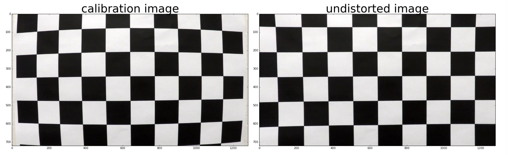
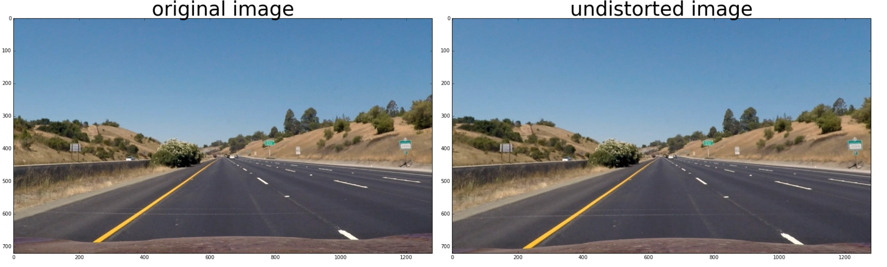
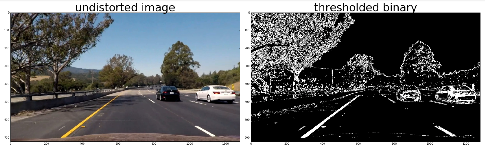
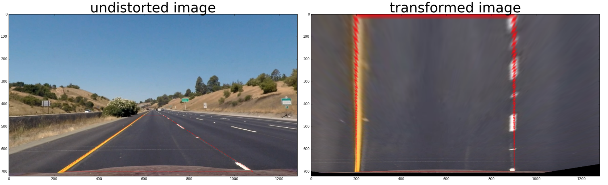
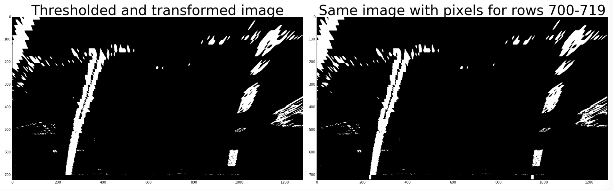
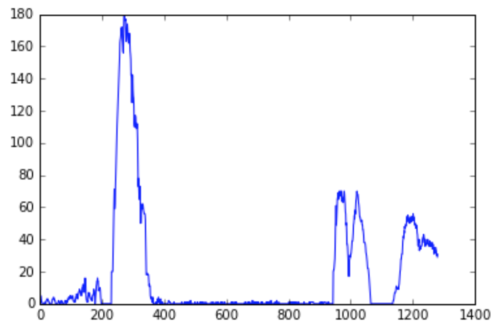
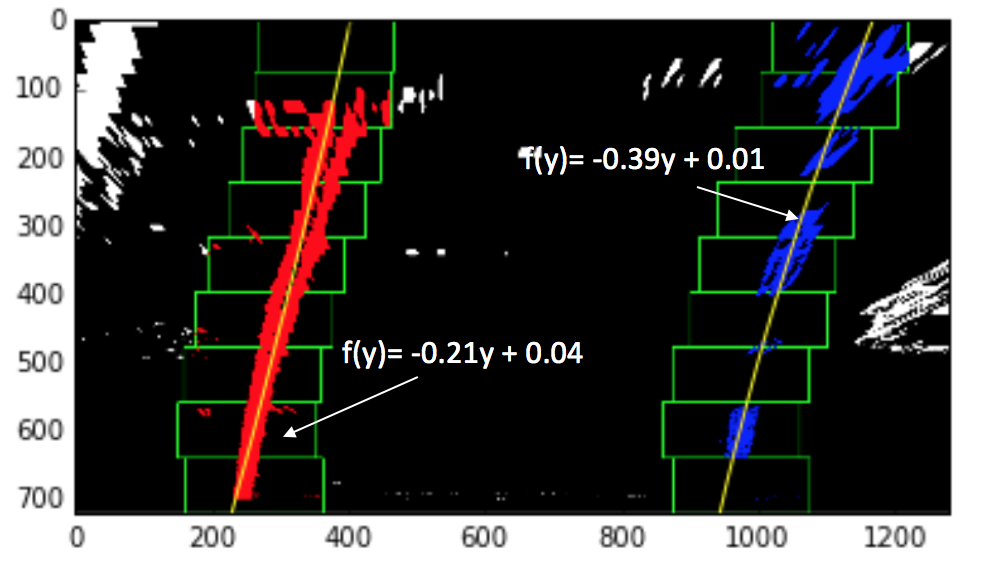
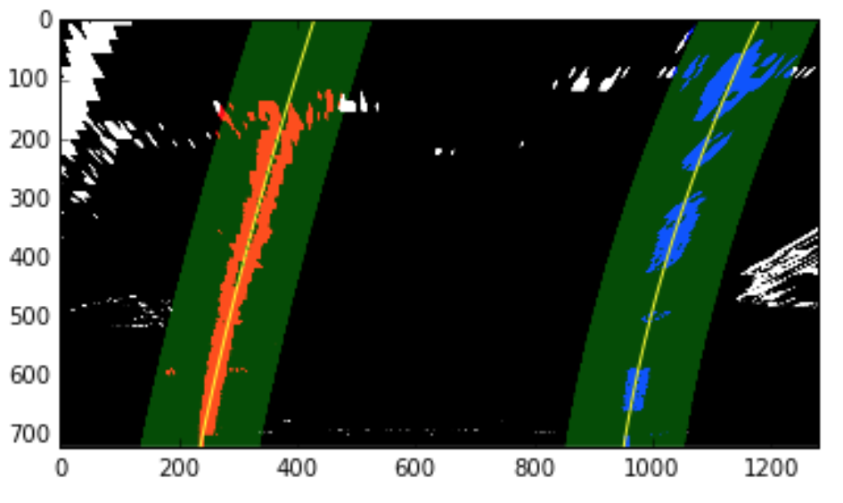
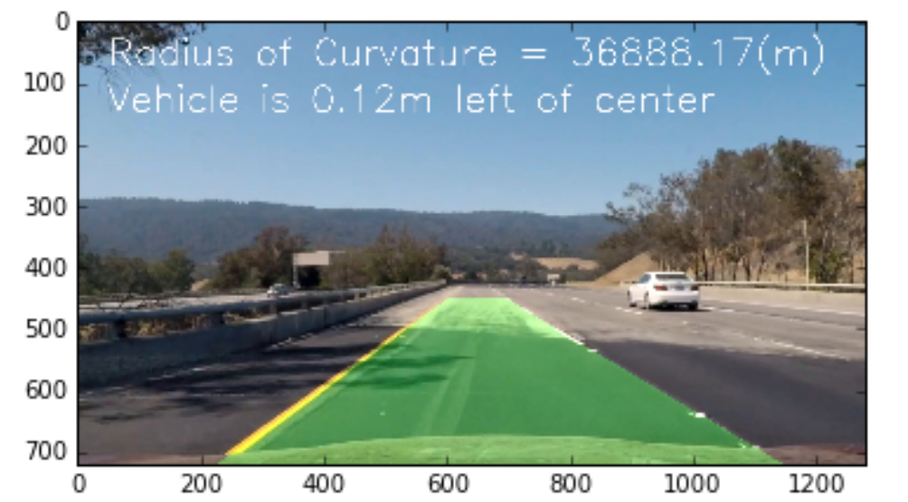

# Assignment-4: CarND-Advanced-Lane-Lines

## Advanced Lane Finding Project

### Goal
The goal of this project is to write a software pipeline to identify the lane boundaries in a video from a front-facing camera on a car. 

### Steps to complete this project are the following:
1. Compute the camera calibration matrix and distortion coefficients given a set of chessboard images.
2. Apply a distortion correction to raw images.
3. Use color transforms, gradients, etc., to create a thresholded binary image.
4. Apply a perspective transform to rectify binary image ("birds-eye view").
5. Detect lane pixels and fit to find the lane boundary.
6. Determine the curvature of the lane and vehicle position with respect to center.
7. Warp the detected lane boundaries back onto the original image.
8. Output visual display of the lane boundaries and numerical estimation of lane curvature and vehicle position.

#### Step 1: Computer the camera calibration matrix and distortion coefficients given a set of chessboard images

The code for this step is contained in the 4th code cell of the IPython notebook located in "./advanced_lane_lines_for_submission.ipynb".

1. First, Read in calibration images of the chessboard.  it is recommended to use at least 20 images to calibrate the camera
2. Map the corner coodinates of the 2D images (image points) to the 3D coordiates of the real undistorted chessboard corners (object points)
3. The object points are the known coordinates of a 9x6 chessboard in 3D (x,y,z) coordinates with z = 0 for all points
4. Use the cv2.findChessboardCorners() method to find the image points.  If the function detects the 9x6 chessboard corners, the image will be used to calibrate the camera.
5. Pass the detected image points and objects points for all calibration images to the cv2.calibrateCamera() method to calibrate the camera

    

```
nx = 9   
ny = 6

objpoints = []
imgpoints = []

# prepare object point [0,0,0], [1,0,0], [2,0,0]...[8,5,0]
objp = np.zeros((nx * ny, 3), np.float32)
objp[:,:2] = np.mgrid[0:9, 0:6].T.reshape(-1, 2)

# loop through the calibration images to find the objpoints and imgpoints
images = glob.glob("camera_cal/calibration*.jpg")
for filename in images:
    img = mpimg.imread(filename)
    gray = cv2.cvtColor(img, cv2.COLOR_RGB2GRAY)

    # find chessboard corners
    ret, corners = cv2.findChessboardCorners(gray, (nx, ny), None)

    # only include those that meet the nx, ny requirement 
    if ret == True:
        imgpoints.append(corners)
        objpoints.append(objp)

# find parameters to calibrate the camera
ret, mtx, dist, rvecs, tvecs = cv2.calibrateCamera(objpoints, imgpoints, gray.shape[::-1],None,None)

```

### Software pipeline to identify the lane boundaries 
Now that I calibrated a camera and found the perspective transform matrix to transform the road to bird's eye view, it is ready to create a software pipeline to identify the lane boundaries.


#### Step 2: Apply a distortion correction to raw images

1. Used cv2.undistort() method to correct raw images from the camera. 



#### Step 3: Use color transforms, gradients, etc., to create a thresholded binary image

The code for this step is contained in the 6th & 7th code cell of the IPython notebook located in "./advanced_lane_lines_for_submission.ipynb".

1. I converted the undistorted image to HLS color map
2. Next, I used the S channel to find the color thresholded binary image 

    ```
    s_channel_binary = s_channel_thresh(undist, thresh=(150, 255))    
    ```
3. Next, I used L channel to find the sobel gradient x and sobel gradient y thresholded binary image

    ```    
    gradx = abs_sobel_thresh(l_channel, orient='x', sobel_kernel=ksize, thresh=(20, 100))
    grady = abs_sobel_thresh(l_channel, orient='y', sobel_kernel=ksize, thresh=(20, 100))
    ```
4. Used L channel to find the sobel magnitude and direction thresholded binary image 

    ```
    mag_binary = mag_thresh(l_channel, sobel_kernel=ksize, mag_thresh=(40, 100))
    dir_binary = dir_threshold(l_channel, sobel_kernel=ksize, thresh=(0.7, 1.2))
    ```

5. Combined the color, sobel gradients and direction to create the final thresholded binary image for lane detection 

    ```
    combined_binary = np.zeros_like(s_channel_binary)
    combined_binary[(s_channel_binary == 1) | (gradx == 1) & (grady == 1) | (mag_binary == 1) & (dir_binary == 1)] = 1
    ```

6. I also set all pixels from rows 700 to 719 to 0 because that is the front of car and not part of the road to avoid reflection on the front of the car affects the lane line detection.

    ```
    combined_binary[700:,:] = 0 
    ```




#### Step 4: Apply a perspective transform to rectify binary image ("birds-eye view")

1. Next, I found the perspective transform matrix to create the birds-eye view of the road.  I drew red lines on the undistorted image and then tested different src/dst combinations to make sure the red lines were parallel after the transformation. 

```
s1 = (230, 700)
s2 = (595, 450)
s3 = (685, 450)
s4 = (1082, 700)

d1 = (290, 700)
d2 = (290, 0)
d3 = (990, 0)
d4 = (990, 700)

src = np.array([s1, s2, s3, s4], np.float32)
dst = np.array([d1, d2, d3, d4], np.float32)

M = cv2.getPerspectiveTransform(src, dst)
Minv = cv2.getPerspectiveTransform(dst, src)
```

This resulted in the following source and destination points:

| Source        | Destination   | 
|:-------------:|:-------------:| 
| 230, 700      | 290, 700      | 
| 595, 450      | 290, 0        |
| 685, 450      | 990, 0        |
| 1082, 700     | 990, 700      |



#### Step 5: Detect lane pixels and fit to find the lane boundary

1. In the last step of Step 3, I removed all pixels of the thresholded binary image from row 700 to 719 to avoid pixels detected with the front of the car.  Here, I added back the pixels to the transformed thresholded binary image based on the averaged x values of the transformed images at row 700 from the last 5 iterations.  If this is the first thresholded binary image, no pixel was added. 

    ```
    if (left_lane.bestx != None) and (right_lane.bestx != None):
        binary_warped[700:,left_lane.bestx-5:left_lane.bestx+5] = 1
        binary_warped[700:,right_lane.bestx-5:right_lane.bestx+5] = 1
    ```
    
    

2. If this is the first thresholded binary image, I used the blind search method to find the lane line.  The blind search method checked the histogram of the lower half of the transformed image by adding up the pixel values along each column in the image.  Two most prominent peaks in this histogram would be used of the x-position of the base of the lane lines.  Please refer to the 8th code cell of the IPython notebook located in "./advanced_lane_lines_for_submission.ipynb".

    

  1. Once the base of the lane lines was found, I used the sliding window method to find all the points that belong to the lane line
  2. Next, fit all the points to the np.polyfit() method to find the polynomial that represents the lane line.
  
    

3. If this is not the first thresholded binary image, I used the previously found polynomials for the last 5 iterations to find all the points that are part of the lane line and fit these points to the np.polyfit() method to create a new polynomial. Please refer to the 9th code cell of the IPython notebook located in "./advanced_lane_lines_for_submission.ipynb".

    


#### Step 6. Determine the curvature of the lane and vehicle position with respect to center

1. To determine the curvature of the detected lane line, I used the detected points from the Step 5 multiply by the meters per pixel in both x and y dimensions to converting the x and y values to real world space. Please refer to the 10th code cell of the IPython notebook located in "./advanced_lane_lines_for_submission.ipynb".

    ```
    # Define conversions in x and y from pixels space to meters
    ym_per_pix = 30/720 # meters per pixel in y dimension
    xm_per_pix = 3.7/700 # meters per pixel in x dimension
    
    leftx = left_lane.allx
    lefty = left_lane.ally
    rightx = right_lane.allx
    righty = right_lane.ally
    
    left_fit_cr = np.polyfit(lefty*ym_per_pix, leftx*xm_per_pix, 2)
    right_fit_cr = np.polyfit(righty*ym_per_pix, rightx*xm_per_pix, 2)
    ```
2. Then I calcuated the curvature of the detected left and right lane lines
    ```
    y_eval = 720
    # Calculate the new radii of curvature
    left_lane.radius_of_curvature = ((1 + (2*left_fit_cr[0]*y_eval*ym_per_pix + left_fit_cr[1])**2)**1.5) / np.absolute(2*left_fit_cr[0])
    right_lane.radius_of_curvature = ((1 + (2*right_fit_cr[0]*y_eval*ym_per_pix + right_fit_cr[1])**2)**1.5) / np.absolute(2*right_fit_cr[0])
    ```
 
3. To calculate the position of the vehicle position with respect to center, I calculated during the Step 5 during lane lines detection. I  have changed the definition of the variable line_base_pos in the class Line to means the distance in meters of vehicle center from the center of the lane. Please refer to the 8th & 9th code cell of the IPython notebook located in "./advanced_lane_lines_for_submission.ipynb".

    ```
    # Find distance in meters of vehicle center from the center of the lane
    left_lane.line_base_pos = (leftx_base + rightx_base - 1280)/2 * 3.7/700
    right_lane.line_base_pos = (leftx_base + rightx_base - 1280)/2 * 3.7/700
    
    ```

#### Step 7. Warp the detected lane boundaries back onto the original image

1. Before warpping the detected lane boundaries back to the original image, I did a sanity check to see if the detection makes sense.   Please refer to the 11th code cell of the IPython notebook located in "./advanced_lane_lines_for_submission.ipynb".


  1. Checked the curvature of the detected lane lines to see if they are in the ball-park.  If the curvature was bigger than 700, I found that the chances the 2 lane lines differ significantly were very high.  So, I skipped checking if the samller of the 2 curvatures was bigger than 700.  For curvature smaller than 700, if they differed by more than 300 meters, the detection was considered as failed. 
 
    ```
      if (np.min([left_lane.radius_of_curvature, right_lane.radius_of_curvature]) < 700) & \
        (np.abs(left_lane.radius_of_curvature - right_lane.radius_of_curvature) > 300):
        return False  
    ```
  
  
  2. Checked the horizontal distance between the 2 lane lines. If any horizontal distances between the 2 lane lines are more than 100, the detection was considered as failed. 
  
    ```
    left_fit = left_lane.current_fit
    right_fit = right_lane.current_fit
    
    # check the horizontal distance 
    ploty = np.linspace(0, 719, num=720)
    left_fitx = left_fit[0]*ploty**2 + left_fit[1]*ploty + left_fit[2]
    right_fitx = right_fit[0]*ploty**2 + right_fit[1]*ploty + right_fit[2]
    
    dist = abs(left_fitx - right_fitx)
    #print(np.max(dist), np.min(dist))
    if (np.max(dist) - np.min(dist)) > 100:
        return False
    ```
    
  3. If the sanity check was successful, the detected lane lines will be added to the list of recent measurements for calculating the average values over the last 5 succeesfully detected lane lines to obtain a cleaner result for drawing  
  
    ```
    # add the left_fitx at 700 to the recent_fitx
    left_lane.recent_xfitted.append(left_fitx[700])
    right_lane.recent_xfitted.append(right_fitx[700])
    
    # find the best x position at 700
    left_lane.bestx = np.average(left_lane.recent_xfitted[-5:])
    right_lane.bestx = np.average(right_lane.recent_xfitted[-5:])
    
    # add the fits to the list
    left_lane.all_fits.append(left_lane.current_fit)
    right_lane.all_fits.append(right_lane.current_fit)
     
    # find the best fits over the last 5 iterations  
    left_lane.best_fit = np.average(left_lane.all_fits[-5:], axis=0)
    right_lane.best_fit = np.average(right_lane.all_fits[-5:], axis=0)
    ```

4. If the sanity check failed and the sanity check of the last lane lines detection was successful, I used the the average values over the last 5 frames of video for drawing  

5. If the sanity check failed and the sanity check of the last lane lines detection was also not successful, I would perform another round of blind search method mentioned in Step 5 to detect the lane lines.  

  1. If the lane lines detection was successful this time, the detected lane lines would be added to the list of recent measurement similar to 3. in the current step. 
  
  2. If the lane lines detection failed again, I used the the average values over the last 5 frames of video for drawing. 


#### Step 8. Warp the detected lane boundaries back onto the original image

1. I used average values over the last 5 succeesfully detected lane lines to find the lane curvature and the lane lines to warp back onto the original image. Please refer to the 12th code cell of the IPython notebook located in "./advanced_lane_lines_for_submission.ipynb".

    Here is an example of the detected line line:
    


## Discussion 

1. The pipeline has problem detecting lane lines if there is a high color contrast of the road.  The saturation channel of the HLS color map fails to distinguish the  
